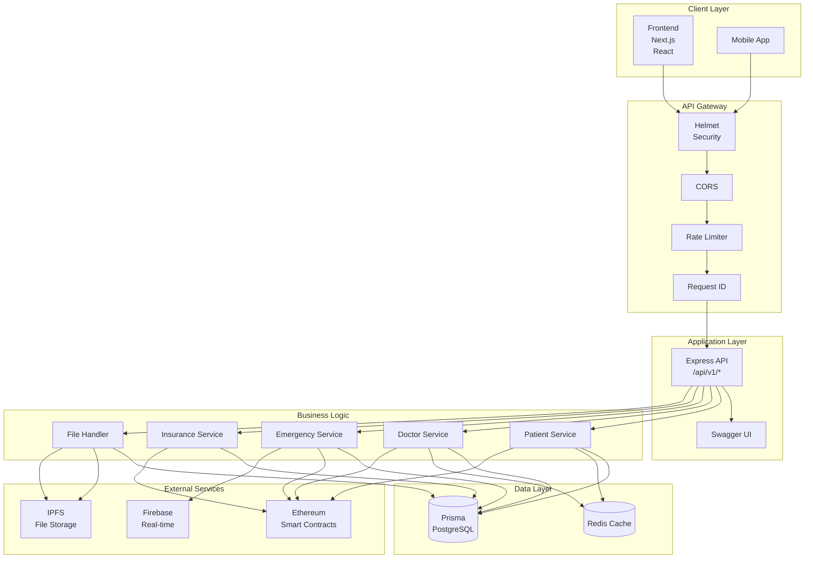
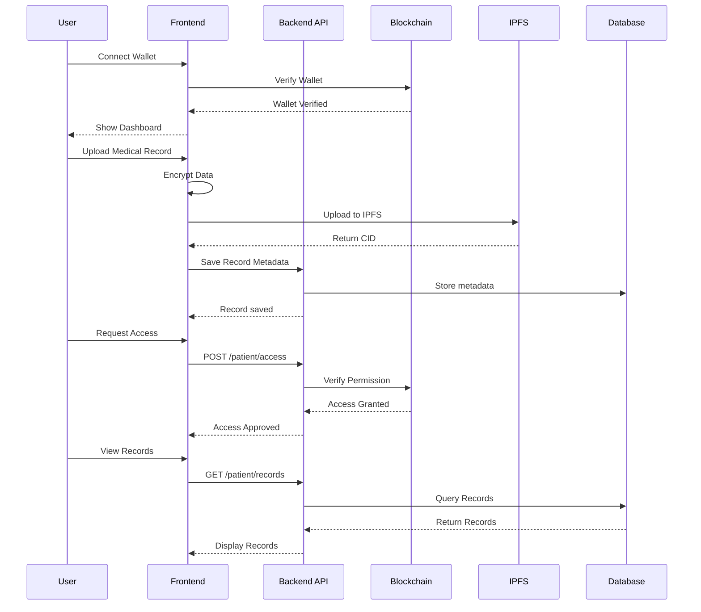
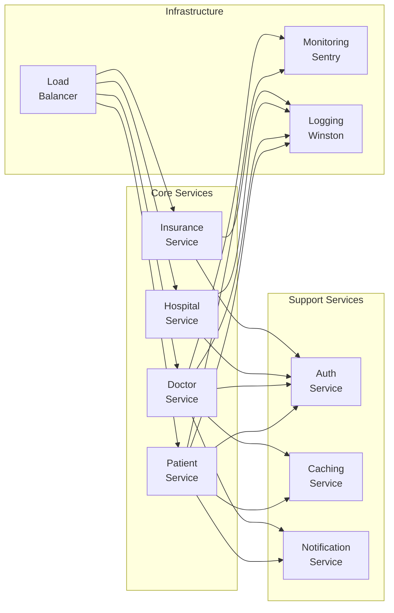
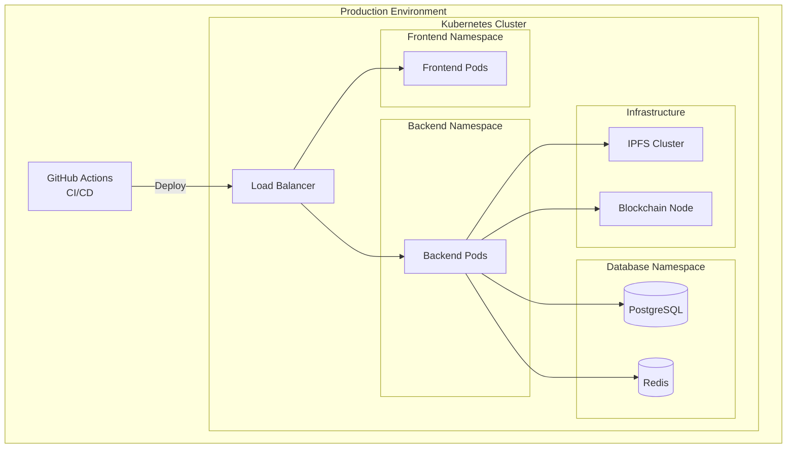

# MediSecure Architecture

## System Overview

```mermaid

┌─────────────────────────────────────────────────────────────────────────────────┐
│                              MediSecure Platform                                 │
└─────────────────────────────────────────────────────────────────────────────────┘

                              ┌──────────────────┐
                              │    Frontend      │
                              │   (Next.js)      │
                              │    :3000         │
                              └────────┬─────────┘
                                       │
                                       ▼
┌─────────────────────────────────────────────────────────────────────────────────┐
│                              Load Balancer / Reverse Proxy                       │
└─────────────────────────────────────────────────────────────────────────────────┘
                                       │
                     ┌─────────────────┴─────────────────┐
                     ▼                                   ▼
         ┌───────────────────┐                 ┌───────────────────┐
         │   Backend API      │                 │   Static Files   │
         │   (Express)        │                 │   (Next.js)       │
         │   :5000            │                 │                   │
         └─────────┬─────────┘                 └───────────────────┘
                   │
     ┌─────────────┼─────────────┬───────────────┐
     ▼             ▼             ▼               ▼
┌─────────┐  ┌─────────┐  ┌──────────┐  ┌──────────┐
│  Redis  │  │ Postgres │  │   IPFS   │  │ Ethereum │
│ Cache   │  │   DB    │  │  Storage │  │   (L1)   │
└─────────┘  └─────────┘  └──────────┘  └──────────┘
```

## Component Diagram



## Data Flow



## Service Architecture



## Technology Stack

| Layer | Technology | Purpose |
| ------- | ------------ | --------- |
| Frontend | Next.js 14, React 18 | Web UI |
| Styling | Tailwind CSS | Styling |
| State | React Context | State management |
| Backend | Express 5 | REST API |
| Database | PostgreSQL + Prisma | ORM |
| Cache | Redis | Caching |
| Blockchain | Ethereum + Web3 | Smart contracts |
| Storage | IPFS + Pinata | File storage |
| Auth | JWT + Wallet | Authentication |
| Monitoring | Sentry | Error tracking |
| Logging | Winston | Structured logging |
| Docs | Swagger | API documentation |

## Security Architecture

```mermaid
┌─────────────────────────────────────────────────────────┐
│                    Security Architecture                 │
├─────────────────────────────────────────────────────────┤
│                                                         │
│  Layer 1: Network & API Security                        │
│  ┌─────────────────────────────────────────────────┐  │
│  │  • HTTPS/TLS & CORS Whitelisting                │  │
│  │  • Rate Limiting & Helmet.js Headers            │  │
│  │  • Zod Input Validation & Request Tracing       │  │
│  └─────────────────────────────────────────────────┘  │
│                                                         │
│  Layer 2: On-Chain Hardening (Sanjeevni Protocol)      │
│  ┌─────────────────────────────────────────────────┐  │
│  │  • Centralized MediSecureAccessControl Registry  │  │
│  │  • Type-Safe Roles (Enum-based RBAC)            │  │
│  │  • 48-Hour Governance Timelock Controller       │  │
│  │  • Chainlink Decentralized Price Oracles        │  │
│  └─────────────────────────────────────────────────┘  │
│                                                         │
│  Layer 3: Privacy & Data Integrity                     │
│  ┌─────────────────────────────────────────────────┐  │
│  │  • ZK-Proofs for Privacy-Preserving Insurance   │  │
│  │  • Client-Side Peer-to-Peer Encryption          │  │
│  │  • UUPS Upgradeable Proxies with Multi-Sig      │  │
│  │  • Immutable Clinical Audit Trails (Handoffs)   │  │
│  └─────────────────────────────────────────────────┘  │
│                                                         │
└─────────────────────────────────────────────────────────┘
```

## Deployment Architecture



## API Endpoints Summary

| Method | Endpoint | Description |
| -------- | ---------- | ------------- |
| GET | `/health` | Health check |
| GET | `/api-docs` | Swagger UI |
| POST | `/api/v1/patient/vitals` | Sync vitals |
| POST | `/api/v1/emergency/access` | Emergency access |
| POST | `/api/v1/files` | Upload file |
| POST | `/api/v1/doctor-verification/verify` | Verify doctor |
| POST | `/api/v1/insurance/claim` | Submit claim |
| GET | `/api/v1/messaging` | Get messages |

## Database Schema (Simplified)

```mermaid
┌──────────────┐     ┌──────────────┐     ┌──────────────┐
│   Patient   │     │   Doctor    │     │  Hospital    │
├──────────────┤     ├──────────────┤     ├──────────────┤
│ id          │     │ id          │     │ id           │
│ walletAddr  │     │ walletAddr  │     │ walletAddr   │
│ name        │     │ name        │     │ name         │
│ email       │     │ specialty   │     │ address      │
│ encryptedData│    │ verified    │     │ verified     │
└──────┬───────┘     └──────┬───────┘     └──────────────┘
       │                   │                   │
       └─────────┬─────────┴───────────────────┘
                 ▼
       ┌──────────────────┐
       │    Record        │
       ├──────────────────┤
       │ id               │
       │ patientId        │
       │ doctorId         │
       │ ipfsCid          │
       │ accessList       │
       │ createdAt        │
       └──────────────────┘
```
